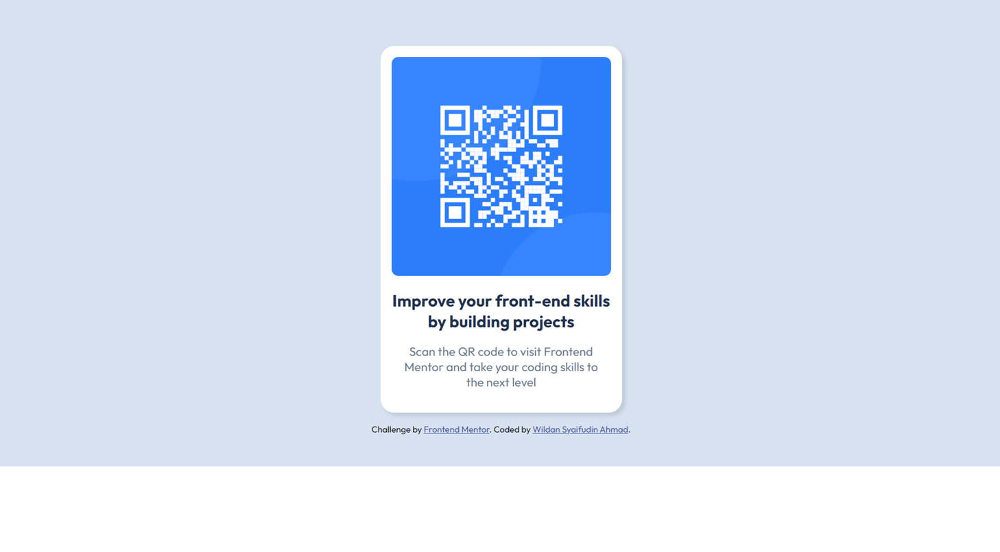

# Frontend Mentor - QR Code Component Solution

This is a solution to the [QR code component challenge on Frontend Mentor](https://www.frontendmentor.io/challenges/qr-code-component-iux_sIO_H). Frontend Mentor challenges help you improve your coding skills by building realistic projects.

## Table of Contents

- [Overview](#overview)
  - [Screenshot](#screenshot)
  - [Links](#links)
- [My Process](#my-process)
  - [Built With](#built-with)
  - [What I Learned](#what-i-learned)
  - [Useful Resources](#useful-resources)
- [Author](#author)

## Overview

### Screenshot




### Links

- Solution URL : (https://github.com/SanCross354/frontend-mentor-project)
- Live Site URL :(https://qr-code-wildan.netlify.app)

## My Process

### Built With

- Semantic HTML5 markup
- CSS custom properties
- Flexbox
- Responsive design with media queries

### What I Learned

In this challenge, I focused on centering elements properly using Flexbox and ensuring responsiveness. Initially, I struggled with aligning the card component perfectly in the center, but by using `display: flex; align-items: center; justify-content: center;`, I was able to achieve the desired layout.

Additionally, I learned how to apply `max-width` effectively to ensure the QR code component remains responsive on smaller screen sizes.

Here’s a snippet of my CSS:

```css
body {
  background-color: hsl(212, 45%, 89%);
  font-size: 15px;
  font-family: "Outfit", sans-serif;
  height: 100vh;
  display: flex;
  flex-direction: column;
  align-items: center;
  justify-content: center;
}

.card {
  background-color: hsl(0, 0%, 100%);
  border-radius: 20px;
  box-shadow: 5px 5px 5px rgba(0, 0, 0, 0.1);
  padding: 1rem;
  max-width: 320px;
}

p {
  text-align: center;
  padding: 0 1rem; /* Padding only left and right */
}
```

### Useful Resources

- [MDN Flexbox Guide](https://developer.mozilla.org/en-US/docs/Learn/CSS/CSS_layout/Flexbox) - Helped me understand how to center elements properly.

## Author

- Frontend Mentor - [@SanCross354](https://www.frontendmentor.io/profile/SanCross354)
- GitHub - [@SanCross354](https://github.com/SanCross354)
